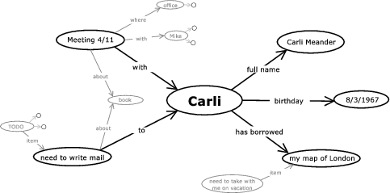
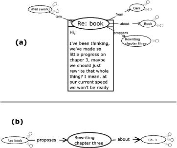
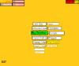
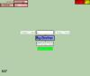
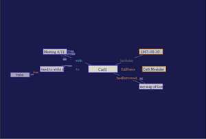
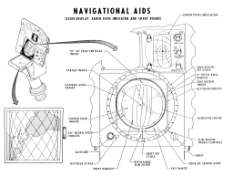
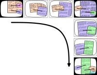
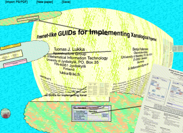

=================================================================
Hyperstructure: Computers built around things that you care about
=================================================================
-----------------------------
Version 4, revised 2004-06-30
-----------------------------

.. line-block::

   **Benja Fallenstein and Tuomas J. Lukka**
   Hyperstructure Group
   Agora Center, University of Jyväskylä
   P.O.Box 35, FIN-40014 Jyväskylä, Finland
   E-mail: b.fallenstein@gmx.de, lukka@iki.fi

.. contents::

Abstract
========

Computers should help us with **organizing our lives**, rather
than making them more difficult. We conjecture that we need
a system **structured** around **items** -- 
**things that we care about**, such as people, arguments and ideas,
and able to express the relationships between them,
so that connected to e.g. an idea we see all arguments
we have considered for or against it.

Based on Nelson's ideas,
we describe the design of a computing environment based on a **hyperstructure**,
a user-visible data structure for **connecting related items**
and storing information about them (using typed bi-directional links).

We also discuss Fenfire, our implementation-in-progress,
and related user interface innovations
particularly suited for hyperstructure.

1 Introduction
==============

Computers are supposed to be "information technology,"
to help you to keep your information organized. 
An ideal environment should help us keep track of, for example,

- "Personal information": contacts, addresses, appointments, birthdays;

- Ideas: thoughts, arguments, proposals, hopes,
  fears, plans;

- Work: budgets, employees, phone calls, 
  courses we have taken, marks we have been awarded, 
  types of poems, types of plants, 
  classes in a program and structures in a plot.

This system
should **center around the things we care about**,
the people, appointments and so on. We believe that a system is needed
in which these **items** (`Nelson 2000`_) are visible things
that can be connected to each other;
in technical terms, a hypermedia system in which items
are first-class objects. 

There are prototype
hypermedia systems that allow a file to contain 
varying schemas of information suitable for
representing items. However, to obtain an environment
in which all items can be connected to other items,
the items have to be first-class in the operating 
system itself -- similar
to the ideas in HOSS/structural computing
(`Nürnberg et al 1996`_, `Nürnberg et al 1997`_).

In contrast, in the mainstream file system paradigm,
only documents and groups of documents (folders) are represented 
as first-class objects.
While documents certainly qualify as things that we care about,
other items like people, theories, or places are not 
explicitly represented in this paradigm at all. 
Additionally, file systems are simple hierarchies,
rather than allowing arbitrary relationships between items
to be expressed. Information like "In this meeting, we discussed
possible solutions A, B, C to problem X, and our consensus
was that...," for example, might be hidden in a document called
"Minutes 2003-07-24."

In an item-centric system, this information would be expressed
as relationships between several items: the problem, the meeting,
the solutions discussed, the arguments raised in this discussion,
the decisions reached. Looking at the problem item, for example,
the user would connect to it the solutions that have
been discussed for it, and to them
the arguments that have presented in favor or against each
of the solutions-- no matter in which meeting, in which e-mail,
in which memo or in which chat session they were made.
(On the other hand, the user could just as well look at all the points
made in a particular meeting, no matter which topic they were about.)

In file systems, you have to remember what information you
stored where, like with paper notes. We conjecture that
an item-centric system can improve on this problem greatly,
because after you have connected information to an item,
the information can always be shown when looking at that item.

Also, many items that do have a representation in current systems--
for example appointments (often all appointments are stored
in a binary, proprietary database file) and e-mail
(usually several stored in one file)-- are not represented as files.
In mainstream systems, it is generally not possible to make connections
between an e-mail and an appointment if they are stored
in different files.

Hypermedia was meant to be an extension to the mind: 
Vannevar Bush entitled his famous article "As We May Think" (`Bush 1945`_);
`Engelbart (1962)`_
set "Augmenting Human Intellect" as his goal, and `Nelson (1965)`_
envisioned a system "holding everything [a novelist or absent-minded
professor] wanted in just the way he wanted it to be held."

Perhaps an item-centered computing environment
can fulfill this promise.

The remainder of this paper is structured as follows.
In `Section 2`_, we describe our proposed user interface 
for an item-centered computing environment.
In `Section 3`_, we characterize
the underlying item network structure, 
*hyperstructure*, and describe two particular hyperstructures:
Nelson's zzStructure, and the Resource Description Framework
(RDF), which is used in our work. 
We also give a real-world example for the use of hyperstructure.
In `Section 4`_, we describe
the Fenfire project, our effort to implement an item-centered
computing environment. `Section 5`_ discusses related work,
and `Section 6`_ concludes.

.. _`Section 2`:

2 An item-based user interface
==============================

Let us stress that the system we discuss is not primarily
intended as a medium for communicating information
to others, but as a **tool for personal use** -
working/editing/authoring/programming.

Much of the work on the hypertext/hypermedia
field is focused on *presenting* information to and *audience*,
on hypertext/hypermedia being a *medium*. 
The *extensional* structure, 
as introduced by `DeRose (1989)`_ is an important concept 
in this context: it could be said to be structure
that is not part of the medium of presentation.

An item-centered
system could look as shown in Figure 1.

.. _`Figure 1`:

   Figure 1: A mockup of a 
   computing environment centered around *items*,
   things that the user cares about (`larger image`__).
   Our prototype is discussed in `Section 4.2.1`_.

   __ full-example1.gen.png

The item we are currently looking at
is shown in the middle, items related to it are shown
around it. (This visualization is a focus+context (`Furnas 1985`_)
view of the item graph. See `Section 4.2.1`_ for details.)
Items further away fade into the background;
items more than a few steps away are not shown at all.
Clicking on a far-away item will bring it to the center.

**Related items are always near each other.**
This allows you **see the information** you entered 
**in different contexts** than the one 
you entered it in.

This may be intended; for example, when you are planning to meet
somebody, you may want to be reminded of things they borrowed
from you and ought to return. It may also be unintended:
planning the next chapter in your novel,
you notice that you once had an idea about how to develop one
of your characters, which you had forgotten about.

The characters, events, twists
of your story would be items, as would be the chapters
and parts. You would be connecting the chapter you're
working on to the events in that chapter, which would
in turn be connected to the characters they affect; the
characters, in turn, would be connected to your notes
about them, in this case the idea about how to develop
one of them.

One might be concerned what happens if an item has
a large number of connections, in the hundreds or thousands.
There are a number of factors alleviating this concern.

- Firstly, the items shown are only those connected
  directly or through a short path to the item
  we are looking at. Even if we have hundreds of thousands
  of items in the system, we only show a small number of them
  at a time.
- Secondly, as we have stressed above, this is a tool for
  *personal use*, and will presumably contain mostly connections
  made by its particular user. 
  Thus, rather than categorizing
  thousands of e-mails as discussing a particular subject, for example,
  a user could easily categorize them as making a smaller number
  of *arguments*, items connected to the subject.
- Thirdly, connections will be *typed*,
  as shown in the mock-up ("with," "to," "has borrowed"),
  and a user will be able to toggle each connection type to be
  shown or hidden. A user would usually switch off the
  connection types not relevant to the task at hand,
  reducing the number of connections shown. For example, 
  when composing e-mail to the attendees of a meeting, 
  you probably don't need to know the attendees' 
  birthdays.
- Finally, in the case that there *are* a lot of connections
  with the same type to the same item, we show them as a
  scrollable list, and allow the user to specify the sorting order.
  This is useful when you want to, for example,
  see all your e-mails sorted by date. We are also working on 
  interfaces where there are several foci and the nodes on the paths
  connecting the foci are emphasized and others de-emphasized - 
  this could make browsing a graph with a high
  local degree significantly easier.

We propose to **build a whole computing environment**
organizing information around items, rather than
splitting it up into files.

Some of the items in the system will still be documents,
such as letters, e-mails, images and so on,
and the bodies of these documents will still be characters,
pixels and so on. However, as items, the documents will be woven
into the network of items and thus connected to, for example, the things that
they talk about, the people that created them, the meetings
they propose and the problems they solve, for example as shown in Figure 2.
We conjecture that it will be much easier to find relevant documents
in such a system than it is in the simplistic hierarchical
categorization of files and folders.

It would certainly be possible to implement this
by storing documents as files on a file system and load them
transparently when they need to be shown in the network
of items, even though that is not the approach we have taken.
What is important to us is the user experience, in which documents
are woven into a network of items rather than categorized into
a hierarchy of folders.

.. _`Figure 2`:

   Figure 2: (a) An e-mail, with connections to other items.
   (b) After clicking on "Rewriting chapter three."
   The contents of the e-mail are hidden. We can get back
   to the view of (a) by clicking on "Re: book." 
   (`Larger image`__)

   __ full-document-connections.gen.png

Instead of having separate applications, we would have **views**
for **specific kinds of information**.
For example, a historian might want to mark places on a map,
connecting them to the events that have taken place there,
and they might want to show the events on a zoomable timeline. 
Multiple views for the same information
have long been recommended by both `Engelbart (1990)`_ and
`Nelson (1993)`_.

There may also be views that add information
about items shown in arbitrary other views. For example,
we might construct a view that, whenever we are looking
at an event, shows our expenses for that event in small red
numbers under the event. It could do this whether we are
looking at the event in a timeline view, in a map view,
or simply in the network of items.

To allow such *annotations* to be added to a view,
this view must expose to the system which items are
shown where on the screen. An *annotating view* can then
show additional information next to it.

The view that shows items' connections to other items--
for example, the connection between places on a map
to events in a history-- is one such annotating view.

Note that connections are made to items, not to
particular views of items. One can view the same item
using different views, yet its connections stay the same
in each case. Also, while the network of items can be versioned
(by keeping a version history), views of it are not. However,
views can *show* differences between versions if a version history
is kept in the underlying storage layer.

The content of a document or e-mail is shown when it is 
close enough to the focus. Similarly, the map or timeline would be shown when the
user has selected a place or event. In this way, **all views 
are part of the network of items.** (Like the visualizations of the basic
network of items, this is a focus+context view; see `Section 4.2.1`_.)
(There may be more than one view available for the same item.
The user can choose between alternative views through a menu.)

A user would be able to **choose the views appropriate for the
task at hand**, which may come **from different sources**. 
The historian's map and timeline views may have been developed
independently, for completely different purposes, and it may
have been the user who re-purposed them for their work.
(For convenience, the user may create menus and choose
view defaults for each task, providing quick access
to the functionality needed for this task.
Menus may simply be commands organized
in the same connective structure as the items.)

Instead of forcing the user to think in applications,
such a system lends itself to be structured around
the user's tasks. `Nelson (1999b)`_ uses the term
**applitude** for such a "[zone] of functionality."
An applitude is not "walled off" from the rest of the
system; when information from a different applitude
is needed, it is always available. 

We emphasize that applitudes can be created by a normal user 
without any programming, just by *using* the system 
in a particular way. However, applitudes
may also be products, templates for using the system
in a particular way, possibly with their own tailor-made
views and commands.
A user of such an applitude would always be free to extend it
to suit their needs or to repurpose the views and commands
for use in a different applitude.

Items are **not owned
by any single applitude**: When you need to connect
information to an item that doesn't fit into the
current applitude, you can always do so by creating
a new type of relationship. 

For example, besides
connecting places on the map to historical events, our historian
might decide to also connect them to their estimated population.
As connections form a fundamental part of most applitudes
anyway, adding additional connections doesn't seem out of place;
the extensions become a seamless part of the applitude.

Items **may have roles
in more than one applitude**; for example, a person
may exist both in our scheduling applitude, and
the address book we use when writing e-mail.

Such an environment would not only help us structure the
information we already store in our computers, we hope that it will also
help us to **organize our thoughts**.
Paper notes don't work: Unless you are really tidy, you
have to remember that you took a note about a subject
a year ago, or you won't find it. If we could **connect
our thoughts and ideas to the subjects they are about**,
they would be in the place we need them. If we connect all
the arguments that come to mind to the counter-arguments
that we have considered, we would not have to think
through them again.

The advantage of
using a network of items isn't to simply have *more*
connections; it is to store one's ideas in a
semantic network, storing the relationships between
subjects, problems, solutions, ideas and arguments.
Textual notes would become
annotations that elaborate on particular items. 
       
The problem with paper notes is that when considering
a particular subject, there is no way to find all the
notes you have about this subject. Even if you recollect
that you made *some* notes about the subject, likely
you cannot remember where you put them. 

By storing
your ideas in a network of items, when looking at a
particular subject, you can easily see all ideas
that you have earlier connected to this subject,
and from there all notes you have written about these ideas.
We believe that this can solve the problem of not being able
to find the relevant notes.

.. _`Section 3`:

3 Under the hood: Hyperstructure
================================

The underlying infrastructure of an item-centered computing environment
is the *network of items*. This network is a **hyperstructure**,
meaning that it allows an arbitrary number of data structures
to add information about an item through bidirectional connections.
For example, an address book structure may give
a person's name and e-mail, while a genealogy structure might
give their parents, children, and spouses.

To be used in this way, a hyperstructure must have a
simple visualization that allows a user to browse and edit
the network of items. When the user is looking at an item,
this visualization must show the related items nearby;
if the user has to scroll or click through menus first,
the network of items loses its usefulness.

With `Nelson (1999b)`_, we propose to use hyperstructure
not only for the network of user-relevant items, but also
for the data the system needs to store internally.
For example, when placing items onto a map, these items' 
x/y coordinates are normally not relevant to the user,
and therefore not items. Still, they can be stored in the
hyperstructure, available for the user to look at if they
want to [#unix-command-line]_.
By making the internals of the system work the same way
as the network of items that users use daily, they can
be more easily understood even by a non-advanced user,
making them less arcane.

We use the term hyperstructure to **denote a storage model**
that allows different data structures to overlap, but to
**connote** being used as the basis of an **item-based hypermedia system**.
This is the sense of the word in which it was used in the title
of the First Hyperstructure Workshop at Hypertext'03.

Hyperstructure may be implemented in many ways. 
In the remainder of this section,
we present zzStructure and RDF,
two hyperstructures actually used
in systems aiming at the goals we have described above.
We then give a real-world example for the use of hyperstructure.

RDF and zzStructure are actually closely
related: zzStructure is obtained if a RDF graph is constrained
by two uniqueness conditions: for all x, y, there can be
at most one triple of the form (x, y, \*),  and 
at most one triple of the form (\*, y, x). For a graph theoretic
analysis of zzStructure, see `McGuffin (2004)`_.

Hyperstructure might also be 
implemented, for example, as a relational database, 
with individual data structures being represented as tables.
Since hyperstructure requires extensibility to new individual data structures,
this would necessitate a system where users could add
new tables at any time, without hassle.

3.1 zzStructure (used in ZigZag)
--------------------------------

Ted Nelson's original
hyperstructure and applitude concepts
were developed for the zzStructure [#zzstructure]_ hyperstructure 
(`Nelson 1999a`_), supplemented by the
Floating World (`Nelson 1999b`_) ideas.

All data in zzStructure consists of cells. A cell can contain e.g. text, an
image or, in principle, any other unit of data. It does
not matter how the content is stored; cells are the smallest,
indivisible building blocks of zzStructure.

The structure is
formed by connecting cells to each other through dimensions. In each
dimension, each cell can have one positive and one negative
neighbour. This means that all connections between cells are
two-directional. The different dimensions are denoted by names, 
such as d.1 or d.clone.

Even though there are no restrictions on the connections of cells
beyond the above, when any two of the arbitrary number of dimensions
are picked, the structure can be visualized in rows and columns
in a spreadsheet-like manner. Example screenshots 
showing the Gzz implementation of zzStructure are shown in Figures 3 and 4.

.. _`Figure 3`:

   Figure 3: A screenshot of the Gzz implementation
   of zzStructure, centering on a person ("Big Brother")
   in an address book data structure (`larger image`__).

   __ hop1.png

.. _`Figure 4`:

   Figure 4: Gzz centered on the same person
   as in Figure 3, but shown in a genealogy structure,
   using different dimensions (`larger image`__).

   __ change2.png

While the structure *per se* is simple to implement and there are at least 3
independent implementations, mechanisms for interactions
between independently coded applitude views aren't in place.
On the other hand, it is possible to use the different dimensions
as applitudes without special code.

.. Row-and-column views --> table-like visualizability

.. Note this is actually f+c

3.2 Resource Description Framework (RDF, used in Fenfire)
---------------------------------------------------------

Our work is based on using the Resource Description Framework
(RDF, `Lassila and Swick 1999`_) as a hyperstructure.
In the examples we have given above, we have assumed the use of RDF.
RDF is a directed labelled graph structure in which nodes and edge labels
are identified by URIs. Nodes can also be blank, that is,
have identifiers local to a particular graph, or literal
(explicit values such as strings and numbers, rather than URIs).
An RDF graph can be seen as a set of *(subject, predicate,
object)* triples, where each triple is an edge between the
subject and the object, with the predicate as its label.
When discussing RDF, URIs are often abbreviated,
for example ``foaf:Person`` for ``http://xmlns.com/foaf/0.1/Person``.
(FOAF, or "Friend of a Friend," is an RDF vocabulary to support
social networking.)

While zzStructure is simple to browse locally,
because it has higher-level (user-centred) semantics,
programming is often easier in RDF, because many-to-many
relationships can be represented more naturally.

As an example, consider making a list of attendees of a meeting.
In RDF, these would be connected directly to the meeting.
In zzStructure, the meeting would be connected to the first
attendant, and on a different dimension, the first attendant
would be connected to the second, the second to the third,
and so on. Removing one attendant from the set is not as
straight-forward as in RDF; you need to special-case
the case of the first attendant being removed [#rank-headcell]_.
This is a headache especially for versioning.

Using RDF as a hyperstructure, items are nodes. 
Two data structures can independently connect information
to the same item by using different properties. Properties
are the RDF equivalent to zzStructure's dimensions.
RDF triples are not associated with a context.
For example, one cannot create two triples saying that
"Paper A supports paper B" and "Paper A contradicts paper B,"
and then say that the first triple is true under one set
of assertions and the second under another set. 
To represent this information in RDF, one would not 
use a direct connection between the papers; rather,
one would create new nodes for both statements,
and connect them to the two papers as well as to the
sets of assetions under which either statement is true.
(This is how statements about more than two nodes
are generally represented in RDF.)

Visualizations of RDF are generally a two-dimensional
layout of a whole graph, as if drawn on a sheet of paper.
Graphical editors normally let the
user position the individual nodes; additionally,
many editors offer automatic graph-layout algorithms.
In this kind of visualization, when looking at a particular node,
it is often not easy to find the other nodes connected to it.
In particular in large graphs, the node you are looking for
may be in a completely different part of the image. Finding
anything in such a visualization representing *all* the items
a user stores in their computer seems bound to be a herculean task.
These visualizations are therefore not useful for using
RDF as a hyperstructure as introduced above.
However, it is quite possible to build focus+context
views for RDF (`Furnas 1985`_); see `Section 4.2.1`_.

.. _`Section 3.3`:

3.3 A real-world example
------------------------

In this section, we give an example of hyperstructure
in real-world use.
We present how Christel Fallenstein, a fan of Austrian writer
Friederike Mayröcker, uses hyperstructure to keep track of the information 
she wants to remember about Mayröcker's work.

This is currently done in zzStructure
(using our implementation, Gzz), because the Fenfire implementation
is in too early a prototype stage. Below, we will give a
list of the different information structures in this applitude
and show how they could be realized in RDF. We can unfortunately not
include screenshots because of the copyrighted and unpublished
material as well as the private character of the information
in this space.

Poems
    The heart of this information space is a collection
    of published and unpublished poems by Friederike Mayröcker
    (node type ``poems:Poem``). For each poem, we store
    the ``poems:dateWritten`` and for some the ``poems:dateRevised``;
    also, we store the ``poems:title`` and ``poems:text`` of the poem.
    Finally, we store who the poems are ``poem:dedicatedTo``
    as connections to the items representing these people.

    The collection of poems is primarily viewed sorted by
    date written and by *day and month* written, i.e.
    ignoring the year. The latter is useful to see the
    influence of seasons on Mayröcker's work, i.e., to see
    how two poems from February, but from two different years,
    may be similar.

    Most poems are published in at least one ``poems:Book``.
    Here, it is important to be able to keep track of the
    page numbers of each poem *in each book it was published*.
    To realize this, we need an additional RDF node--
    type ``poems:PublicationInfo``; a ``poems:Poem`` is connected
    on ``poems:publishedAs`` to the ``poems:PublicationInfo``,
    which has connections on ``poems:pageNumber`` and
    ``poems:book``, the latter to a ``book:Book``.
    A ``book:Book`` has a ``book:title``,
    a ``book:publicationDate`` and a ``book:abbreviation``--
    for example, Fallenstein abbreviates *Das Besessene Alter*
    to "BA."

Contacts
    For people (node type ``foaf:Person``) we store their
    ``foaf:name`` and possibly their contact information:
    ``foaf:mbox`` (the e-mail address), ``person:address``,
    and ``person:phoneNumber``.

    For Fallenstein, a relatively common use is to look for a person by name,
    then look for poems dedicated to this person. The
    contact information is useful because the user of this
    system often knows the people poems are dedicated to
    and exchanges letters or e-mails with them.

Correspondence
    In addition to the poems, the space contains correspondence
    with Mayröcker and other people interested in Mayröcker's work,
    for example translators of Mayröcker's work in different
    languages, by e-mail and paper mail. An ``m:Letter`` or ``m:Mail``
    (subclasses of ``m:Correspondence``) has ``m:from`` and ``m:to``
    properties connecting them to instances of ``foaf:Person``, 
    as well as an ``m:date``. Mails also have an ``m:subject``.

    In Fallenstein's use of the system, a usual task is 
    to view all the correspondence with
    (from or to) a particular person in chronological order.

    Finally, and most importantly, correspondence is connected
    on ``m:about`` to poems it discusses. This way, it is
    possible to see, when looking at a particular poem,
    all correspondence discussing this poem. This is the most
    important reason for using hyperstructure in this context.

Telephone notes
    Fallenstein and Mayröcker talk on the phone almost daily.
    During these conversations, Fallenstein takes notes about
    their discussions. For each call (``m:Call``), there is a list
    of short notes (``m:CallNote``). A call has a ``m:callDate``
    and possibly some text connected on ``m:callInfo``, noting
    additional information, for example if Mayröcker was on
    vacation. A call would be connected on ``m:callNotes`` to
    an RDF *collection* (`Brickley 2003`_) of the notes,
    providing order for them.

    Call notes have their text connected on ``m:noteText``,
    and again, they are connected to poems they discuss
    on ``m:about``. They are viewed either by looking at the
    poem they discuss, or by browsing them by date.

Readings
    Finally, Fallenstein stores in this space readings
    that Mayröcker gives (``reading:Reading``). Readings have
    a ``reading:date`` and a non-exhaustive list of
    ``reading:attendant`` connections-- people that
    Fallenstein wants to remember have attended the event.
    Readings also have a ``reading:program``, an RDF collection
    of the poems or other texts read that day.

.. _`Section 4`:

4 The Fenfire project
=====================

Fenfire is a free software project aiming at implementing
the applitude-oriented user interface concepts on top of an RDF graph.
Fenfire is a research prototype.

4.1 Structures
--------------

Fenfire provides two interwoven structures for applitudes:
RDF (`Lassila and Swick 1999`_) 
and Xanalogical referential fluid media (`Nelson 1999c`_).

The RDF 
schemas are kept small and orthogonal, and the implementations
are also kept independent as much as possible.
The intent (not quite yet realized) is to allow independently
defined applitude programs to interact through having their
data also in RDF.

4.2 Views
---------

.. _`Section 4.2.1`:

4.2.1 RDF Focus+Context views
"""""""""""""""""""""""""""""

In this section, we describe our basic visualization of RDF
as an easily browsable hyperstructure,
a focus+context (`Furnas 1985`_) view of the graph.
The *focus* at any point is an RDF node, which is shown
in the middle of the screen; the *context* is the nodes
connected to this node, shown around the focus (Figure 5).

   Figure 5: Screenshot of RDF browser prototype.
   This figure shows the same structure as `Figure 1`_.
   (`Larger image`__)

   __ carli.png

No attempt is made at presenting the whole graph
in a two-dimensional layout, or at avoiding overlapping lines,
as many graph-layout algorithms do. We simply show the current
focus in the center, the connected nodes on an ellipse around
the center, the items connected to *those* nodes a bit further out,
and so on [#disorientation]_.

We usually show only a small subset of a node's
relationships at every time: Depending on the task at hand,
the user can "switch" individual relationship types on and off.

This is entirely different from existing
RDF visualization tools, which create
a fixed 2D layout for a graph (sometimes shown in a distorted,
hyperbolic-like view), and then only allow
the user to zoom and scroll through it.

If there are too many connections along the active
relationship types, we show only as many as fit on the screen
and allow the user to scroll through the list. To make this fast
even for very large lists, we plan to employ fisheye sampled
lists (`Furnas 1997`_), in which every element of 
an n-element list can be reached with O(log(n)) clicks.

RDF diagrams usually label nodes with the string that is
used internally to identify the node. This is not acceptable
for showing a network of items; items need to be labeled
by a description the user can understand. 

Unlike zzStructure,
RDF doesn't have the notion of a node label contained "in"
the node. Rather, a node may be connected to literal strings
providing, for example, the name of a person. In our views,
the user can specify which of these properties to show
as the label of a node. If the user does not specify
one, a reasonable default is used (such as ``rdfs:description``,
i.e. a description of the item). URIs are only shown
when a user explicitly requests it.

Also, RDF has no built-in notion of the order of related items;
for example, in which order to list the students in a class.
Fenfire will in the future allow a user to specify different
sorting criteria (first name, last name, birthday etc.)

4.2.2 Buoys
"""""""""""

Buoys are an important part of Fenfire.
The idea of buoys is that some "extra information" - 
be it a comment, or a connection to another document -
is *anchored* to the focused document and 
the representation of the extra information - the buoy -
*floats* around the view relatively freely (see Figure 6);
thus the name.

Buoys' sizes and locations are chosen based on the anchor's
proximity to the center of the view - buoys move around
smoothly when the view is panned or zoomed.

    Figure 6: an image from a NASA document showing
    the inspiration for buoys (`larger image`__).
    The right side, showing the actual panel, is the relevant
    part here.
    Details of parts of the panel 
    "float" around the periphery.
    (The title of the image has nothing to do with
    buoys except by chance).

    __ mercury5.png

Of course, that's not all there is to buoys - an important
part is the fluid animation when the user clicks on 
a buoy: the buoy *slides* into the focus without a disruptive
change in the view, and the route back to the previous
focus location is obvious, as shown in Figure 7.

.. _`Figure 7`:

    Figure 7: a diagram of buoy animation (`larger image`__).
    The "screenshots" with black edges represent
    keyframes, and the others the animation.
    The connecting lines between the focus and the buoys have
    been emphasized in this diagram; in real life, they are
    translucent.
    
    __ buoysMotion.png

The first keyframe in Figure 7
shows the user viewing the orange-colored
document; the user clicks on the light-blue buoy
and the animation to the second keyframe ensues.
There, the user clicks on the green buoy
and the animation to the third keyframe follows.

**There are no disruptive changes to what the user
sees** - going back from the second keyframe
to the orange document is trivial without
an explicit "back button".

Also, buoys move automatically when the document
they are connected to is scrolled. Buoys are arranged
on an ellipse around the viewport, so that the focused
part of the document, inside the ellipse, is not obscured.
Additionally, only buoys whose anchors are visible are shown,
and the buoys whose anchors are close to the focus
are shown larger. This way, the largest buoys are those
connected to things at the focus of the view.

The intent of buoys is to reduce the cognitive overhead
of browsing and editing the structure 
(see `Thüring et al (1995)`_ and
references therein) by 1) providing context to the current node,
2) having the non-disruptive motion between nodes, and
3) by showing the target document directly, instead of an 
icon or some other indirect representation.

Buoys are the key for **making applitude-specific views
part** of the overall **network of items**.

When looking at cities on a map, for example, each city
might be an item connected to other items (e.g.,
a person living in that city) through the
RDF hyperstructure; these connections will be shown
as buoys. 

If the user clicks on one of these buoys (representing a person),
the view will change to an RDF focus+context visualization,
with the item representing the person as the focus,
and the city as another item connected to it. Clicking
on the city-item will take the user back to the map with the
buoys, all in smooth, non-disruptive, animated transitions.

A mock-up example of a similar scenario is shown in `Figure 2`_.

.. _`Section 4.3`:

4.3 Libvob
----------

We have suggested that users should be able to add
connections to views programmed by somebody else.
For example, when showing meetings on a timeline,
it should be easy to add buoys showing the participants
of each meeting. To allow such connections to be added
without changing the view's code, we have developed
Libvob, a flexible user-interface toolkit.

Libvob provides functionality to not only construct
a scene graph (i.e., specify what to draw on the screen)
but to also specify which parts of the scene graph
correspond to which objects in the application model,
the RDF graph in the case of Fenfire. 

The timeline view, for example, would specify which
parts of the scene graph represent each event drawn
(events being nodes in the RDF graph). A different view,
programmed independently, can iterate through these nodes
and connect buoys to each of them. Through the association
with part of the scene graph, it knows *where* to connect
the buoys to.

Libvob also uses a directed acyclic graph as the scene graph,
rather than the conventional tree; i.e., its graphical model
is not hierarchical like that of other toolkits. This provides
natural support for transpointing windows (`Nelson 1995`_),
i.e., connections between different parts of the view hierarchy:
Showing a connection between two different windows is just
as simple as showing a box inside a single window, the only
difference being that the connection has *two* parents
in the scene graph instead of only one.

This is necessary for the implementation of buoys, which
are an instance of transpointing windows (a connection
is drawn between the buoy and the part of the main view
it is related to).

4.4 An example applitude combining multiple structures: FenPDF
--------------------------------------------------------------

FenPDF is the first concrete prototype of our architecture,
using buoys, Libvob, RDF, and Xanalogical referential fluid media (`Nelson 1999c`_).
It is a tool for making sense of academic literature.

    Figure 8: FenPDF, a tool for reading and connecting
    academic articles, using Fenfire's user interface
    technologies (`larger image`__).

    __ fenpdf-shot.png 

FenPDF is used to structure a set of articles
in PostScript or PDF format. Users can transclude
pieces of articles onto *spatial canvases*: infinite,
scrollable papers.
Transclusions are automatically bidirectionally connected 
to the article they are from; a buoy shows a shrunken version
of the article, and clicking on the buoy brings the article
to the center for the user to read.

Additionally, the user can type text onto the canvases,
and link two pieces of text on different canvases
(linked canvases are also shown as buoys).

In the figure, there are two foci. 
The **upper focus** shows **a PDF article**
and its buoys there show the places of
canvases on which there are transclusions from the article.
The **lower focus** shows a **spatial canvas**, containing
**transclusions of PDF articles**,
and the buoys show 
other canvases navigationally linked to the canvas, and
source articles for transclusions.

The canvases and papers use unique backgrounds 
(`Kujala and Lukka 2003`_) to endow them *identity*
in the eyes of the viewer.

We use FenPDF collaboratively in our research group
(synchronizing the RDF graph through CVS).
In practice, we have:

- A canvas for each source (for example, conference,
  journal issue), with transclusions of the titles
  and author lists of the articles published there.
- Canvases for different topics, such as open hypermedia,
  spatial hypertext, and so on. These canvases
  contain transclusions of particularly relevant parts
  of articles, allowing us to collect the central ideas
  from several different articles.
- Canvases for each article we are working on,
  containing notes and transclusions from important
  references.
- Canvases for communicating specific ideas. These
  contain Memex-like "trails" of transclusions from
  different articles, interspersed with text discussing these.
- A central canvas that has links to the other canvases.

In our experience, we have found the transclusion facility 
very useful: copying a well-chosen region of an article
to a canvas allows the user 
reading the canvas 
(either the one who made the
transclusion, or a collaborator) 
to quickly
just read the emphasized part, going back to an article
for the details if desired. The ease with which the transclusions
are created (simply cut and paste) has allowed users to quickly summarize
the most relevant points of the article on a separate canvas for
easy perusal and for contrasting with points from other articles.

In FenPDF, articles, spatial canvases, transclusions
of an article and pieces of text on a canvas are all
represented by RDF nodes. 
On the structure side, FenPDF uses four small RDF vocabularies:

- ``FF``: Associating Xanalogical referential fluid media
  content (`Nelson 1999c`_) 
  to RDF nodes.
  This is used both for text content and transclusions
  from PS/PDF files.

- ``CANVAS2D``: Placing nodes on a canvas - as in
  spatial hypertext (`Marshall and Shipman 1995`_)

- ``STRUCTLINK``: Navigational links between whole RDF nodes

- ``TREETIME``: time order of creation of canvas or importing
  of PS/PDF file

The implementation is similarly structured, separated
cleanly along the vocabularies' edges so new structures
and/or link types should be easy to add.

There is no directly annotation-specific program code in FenPDF. 
The different orthogonal
structures combined just give the user the opportunity 
to create any kinds of structure. 

Explicit support for taxonomic hypertext (`Parunak 1991`_)
and hierarchies is currently being planned.

FenPDF will first be released as a separate application,
but it is designed to become one applitude when the Fenfire system
is complete. The RDF graphs written by the application
will be importable into Fenfire.

Let us briefly explore how a user could extend
this applitude using the techniques presented in
`Section 2`_.

First, metadata about articles, such as author
and publication date, could be represented through simple
RDF connections. Using our RDF views, one could then
for example browse the list of articles of one particular author,
sorted by date.

Similarly, it is possible to switch from spatial hypertext (`Marshall and Shipman 1995`_)
to taxonomic hypertext (`Parunak 1991`_) by replacing the canvases
categorizing articles by source with RDF metadata,
and browse the articles from one source related 
to certain subject matters sorted
by e.g. author or date.

Since the structure is open, it is easy to add new metadata
such as the DOI (Digital Object Identifier,
`Paskin 1999`_) of the articles to allow interoperability
with WWW services such as ACM's web site for, e.g.,
seeing new articles not yet entered to the system by the user
that cite the current article. This would be a good
way to interface our system to the Semantic Web (`Berners-Lee 1998`_).

.. _`Section 5`:

5 Related work
==============

The system we are proposing is a logical extension
of several existing concepts and systems.

5.1 Flexible structure - Unifying structured and unstructured information
-------------------------------------------------------------------------

The *extensional* structure, 
as introduced by `DeRose (1989)`_ is an important concept 
in this context. The extensional structure
is, essentially, the external associations to
the document ("I liked it when I read it in march", 
"It's a little similar in idea to that one", ...)
as opposed to the internal (intensional) structure
(sequence of sections, links to references section, ...).

The Aquanet system, introduced by `Marshall et al (1991)`_,
unified ideas from the freely structured hypertext systems
and tightly structure knowledge representation, 
allowing the extensional structure to be explicitly
represented in the system.
Aquanet uses a frame-based representation,
with custom schemas: classes contain slots to be filled by other
objects. 
However, the system is still restricted to using separate
sessions and defining schemas for each session. 
The system is
a knowledge organization tool, not a full operating environment.

Aquanet is closely related to our work, in that it reifies
items as linkable first-class objects. However, Aquanet
does not appear to have a view that shows all the other items
connected to a particular item, thus allowing users
to browse the network of items.
This is a user interface difference, not a structural one.

The VIKI system is able to find relational
structures based on spatial placements 
of objects (`Marshall and Shipman 1993`_, `Marshall et al 1994`_).

The approach in VIKI was later extended to non-linear
views (`Shipman et al 1999`_) and, in VKB, to support other kinds
of media and navigational links (`Shipman et al 2001`_)
and an agent approach (`Shipman et al 2002`_).

`Haake et al (1994)`_ separate the dimensions of "user defines"
and "system uses" for how object types are embodied in a system. 
The item-based systems are delocalized over this graph, just
as their Dolphin system is: the types are an optional extra.
For items, the types of the *associations* are more important
than the types of the items themselves.

A different kind of flexible structure, the Frame-Axis model,
which focuses on structure that is based on *attribute values*
of items, is
introduced in `Masuda et al (1994)`_.

A non-spatial approach to coexistence of strongly typed
and weakly typed information by using a special Semi Frame
object type is given in (`Furtado and Madeira 1998`_).
A similar approach which allows *incremental formalization*
of data is given in (`Shipman and McCall 1999`_).

Recently, `Kim (2002)`_ proposed to use a graph-based model
as the basis for Engelbart's proposed Open Hyperdocument System,
to allow several underlying data structures to be combined.
This is essentially a proposal for using a hyperstructure,
even though Kim does not discuss visualization.

5.2 Structural computing 
------------------------

Hypermedia operating systems (`Nürnberg et al 1996`_)
and the subsequent structural computing framework (`Nürnberg et al 1997`_)
emphasize the importance of providing structural primitives
in programming languages and the operating system, in order
to help programmers to represent structured information
more easily.

Obviously, such an operating system would provide a great basis for
the implementation of an entirely hyperstructured,
item-based environment.

Structural computing is less concerned with user interface
techniques, however. Providing a user interface that allows
users to extend applitudes and views with additional kinds
of connections is an important part of our work.

Also, structural computing does not put emphasis on choosing
and visualizing the basic structural abstractions so that they can be
easily understood by the user, allowing them to understand
how the system works from inside.

	
5.3 RDF, Semantic Web
---------------------

The Semantic Web community uses RDF to represent
*machine-readable information*. `Berners-Lee (1998)`_ argues that
the World Wide Web has been successful in integrating
human-readable documents, but a similar approach is needed
for machine-readable data.

While we emphasize the use of an RDF hyperstructure
by a *human* user, much of the information a user
stores in Fenfire would be useful data from a Semantic Web
point of view. For example, a calendar created with
Fenfire might be published on the Web, allowing Semantic Web
tools to alert users in the case of conflicting appointments
in a working group.

The other way around, information on the Semantic Web
can easily be shown inside Fenfire. For example, we might
show which doctors are available in our city, if the
local Yellow Pages publish this data as RDF on the Web.

The Semantic Web community is building tools to automatically
convert data between different languages built on top of RDF.
Such tools could be of great use in Fenfire;
for example, when using two views written by different programmers,
which show the same kind of information but assume different
RDF vocabularies, a data conversion tool could convert the
information into the vocabularies expected by either view.

Also, schema languages developed for the Semantic Web
could find applications in Fenfire. For example, if
the system knows that every person has an address, it can
automatically create an address node when a person node is
created; the user then only needs to "fill in the blanks."

5.4 Visualizations of graph structures
--------------------------------------

Work on graph visualizations has mostly concentrated on *graph drawing*, 
laying out graphs on 2D planes or hyperbolic planes while minimizing
crossing edges and possibly under other criteria. While graph drawing
has opened several interesting problems in theoretical computer science,
we are more interested in a more Focus+Context (`Furnas 1985`_) 
approach, 
due to the size of the graphs we are dealing with as well as their
structure which appears to be badly suited for plane drawing, owing 
to the large numbers of interconnections.

Other RDF visualization packages we have found are
of the graph drawing type: RdfViz [#rdfviz]_ and IsaViz [#isaviz]_, both based
on the same 2D plane graph-drawing package [#graphviz]_,
and
Ontorama (`Eklund 2002`_)
uses a hyperbolic-like planar visualization based on tree visualization and 
*cloning* nodes that are in more than one place on the tree.

Work on structure-based focus+context visualizations of graphs,
such as we use, 
was more popular with in the late '80s, related to, e.g., semantic networks
(see, e.g., `Fairchild et al 1988`_, 
`Utting and Yankelovich 1989`_,
`Noik 1993`_).
These visualizations allow the user 
to navigate through the graph locally, with one node as the *focus*,
and showing the neighbouring nodes as context.
Later, a similar style of navigation and structural
editing was also used in the commercial
product TheBrain [#thebrain]_, to allow users to organize files 
and items on their computers.
There is also a very different approach to graph visualization
using boxes and
containment in (`Travers 1989`_).

One of the most important things that is different in the visualizations
presented in this article and the ones discussed above
is that icons are not used
to represent the neighborhood of an item or a document.
In FenPDF, the articles and the canvases are never represented by 
anything other than their image - no file icon, no title
but just the text image itself. With the unique backgrounds, which
allow the user to recognize fragments from articles they 
know well, this
yields in our experience an extremely comfortable system to use,
avoiding the level of indirection inherent in the icons.
This is made possible by the huge advances in the power
of OpenGL graphics systems.

5.5 Open Hypermedia
-------------------

The open hypermedia (OHM) approach to adding structure
to the user's operating environment is wildly 
different from ours.
Instead of focusing on unifying the internal data
model and views and avoiding different "applications",
OHM tries to span the whole desktop by
focusing on hyperlink interoperability between existing
applications (`Pearl 1989`_).

However, Callimachus (`Tzagarakis et al 2003`_)
and the FOHM model (`Millard et al 2000`_) 
are interesting steps
towards a similar approach: they combines the different
hypertext domains into a single conceptual structure.

5.6 Fluid Links and Transpointing Windows
-----------------------------------------

Buoys share some of their aims
with fluid links (`Zellweger et al 1998`_) in 
that they try to reduce cognitive
overhead by showing something of the link target.

.. XXX Sepia, `Thüring et al (1995)`_ cognitive ...

According to Nelson (statement at the Hyperstructure Workshop at Hypertext'03) 
they are an instance of transpointing windows, i.e., the connection "breaks"
the view hierarchy. However, the buoys are completely subjugated
to the focus and are not independent windows *per se*.

.. _`Section 6`:

6 Conclusions
=============

We have presented the design 
of a hyperstructured, item-based computing environment
which **you can structure** according to your needs, rather
than having to structure your work around the applications
provided by the computer.

We have also presented our implementation-in-progress,
Fenfire, which contains two key user interface innovations
for hyperstructure-based systems. 

Firstly, **buoys**
show items connected to a document or image as marginal notes
on a circle around that document or image, and
provide for smooth transitions between documents (`Figure 7`_).
Buoys are a special case of Nelson's transpointing windows.

Secondly, we show items that are part of a document using
a buoy-based view, we show other items using an RDF
focus+context visualization, and we use Libvob (`Section 4.3`_)
to provide animations when moving from one to the other.
This way, we can provide smooth transitions between browsing documents
(buoy-based) and browsing the network of items in the hyperstructure,
making the documents truly part of the network of items
(`Figure 2`_).

An environment like
Fenfire will allow you to do things your way, instead of
the way that some application programmer thought useful.
It will help you to better understand the relationships
between the items in your life. It will provide you with
the information that you need, in the right contexts,
rather than having to open a different application or
search for a file. 
It will help you structure your ideas and thoughts,
and it will help you to structure everything else
in your computer around *them*.

That's why we believe that this will be
"the next big thing."

Acknowledgments
===============

The fundamental ideas in hyperstructure - e.g., the orthogonal
applitudes, are due to Ted Nelson.
The authors were exposed to these ideas in connection 
with the Gzz (earlier called GZigZag)
project, whose goal was to implement zzStructure
in collaboration with him.
In spring 2003, due to various issues including patents, 
our research group quit the Gzz project and
began the Fenfire project, which was essentially all
the technologies (user interface, storage, functional programming -related)
developed in connection with Gzz but using RDF instead of the ZigZag
as the underlying structure. Most importantly, 
the basic Xanalogical referential fluid media paradigm, 
as well as the ideas and goals related
to hyperstructure were retained. This article is an attempt to
clarify our flavors of these ideas.

This has been a difficult article to write,
partly because we are explaining both the ideas
of Nelson and our own ideas and as well as our 
views of Nelson's
ideas in the same article.

To clarify, the following aspects are
Nelson's original work:

- zzStructure
- item-based hypermedia as an alternative computing environment
- focus+context views of zzStructure in rows and columns
- the concepts of hyperstructure and applitudes
- refreshing the view directly from the structure
  by stepping through the structure from the cursor
- transpointing windows
- Xanalogical referential fluid media

And the following ones originate at our group, 
during or after the collaboration
with Nelson:

- using RDF as a hyperstructure
- "vanishing view" of zzStructure, reducing
  scale farther away and showing more cells than the
  basic views (this was used as a base of the loom
  views)
- focus+context visualizations of RDF structure
- buoys
- combining buoys with focus+context visualizations of RDF
  to make documents, images, e-mails and so on part
  of the network of items
- libvob, the vobscene DAG/Tree dual structure
- FenPDF
- Xanalogical referential fluid media
  treatment of PS/PDF files
- the Fenfire codebase

We'd like to thank the anonymous reviewers for their comments.
In addition, we'd like to thank (alphabetically)
Toni Alatalo,
Katariina Ervasti,
Tuukka Hastrup,
Hermanni Hyytiälä,
Antti-Juhani Kaijanaho,
Janne Kujala,
Matti Katila,
Rauli Ruohonen,
Asko Soukka,
and
Kimmo Wideroos
for discussions, and we'd like to thank Christel
Fallenstein for providing us with the real-world
example presented in `Section 3.3`_.

This work was supported by the InBCT 2.1 project.

References
==========

.. _`Berners-Lee (1998)`:
.. _Berners-Lee 1998:

**Berners-Lee, T.** (1998) "Semantic Web Road map".
Available online as
``http://www.w3.org/DesignIssues/Semantic.html``

.. _Brickley 2003:

**Brickley, D., and Gupta, R.V.,** (2003)
"RDF Vocabulary Description Language 1.0: RDF Schema".
W3C Working Draft 10 October 2003. Available at
``http://www.w3.org/TR/rdf-schema/``

.. _`Bush 1945`:

**Bush, V.** (1945) "As We May Think". *The Atlantic Monthly*, 176(1), 
July, 101-108. Available online as
``http://www.theatlantic.com/unbound/flashbks/computer/bushf.htm``

.. _`DeRose (1989)`:

**DeRose, S.J.,** (1989)
"Expanding the notion of links". 
ACM Hypertext'89 proceedings, 249-257.

.. _`Eklund 2002`:

**Eklund, P.W., Roberts, N., and Green, S.P.,** (2002)
"OntoRama: Browsing an RDF Ontology using a Hyperbolic-like Browser".
Proceedings of The First International Symposium on CyberWorlds (CW2002), IEEE press,
405-411.

.. _`Engelbart (1962)`:

**Engelbart, D.C.,** (1962) "Augmenting human intellect: A conceptual framework".
Technical report AFOSR-3223, Stanford Research Institute, SRI, Menlo Park, CA. 
Available online as 
``http://www.bootstrap.org/augdocs/friedewald030402/augmentinghumanintellect/ahi62index.html``

.. _`Engelbart (1990)`:

**Engelbart, D.C.,** (1990) "Knowledge-Domain Interoperability and an 
Open Hyperdocument System". Proceedings of the Conference on 
Computer-Supported Cooperative Work, 143-156. Available online as
``http://www.bootstrap.org/augdocs/augment-132082.htm``

.. _`Fairchild et al 1988`:

**Fairchild, K.M., Poltrock, S.E. and Furnas G.W.,** (1988)
"SEMNET: Three-Dimensional Graphic Representations of Large
Knowledge Bases". In *Cognitive Science and Its Applications 
for Human Computer Interaction*, edited by Guindon, R.
(Hillsdale, New Jersey: Lawerence Erlbaum), pp. 201-233

.. _`Furnas 1985`:

**Furnas, G.W.,** (1985) "Generalized fisheye views".
ACM CHI'86 Proceedings, 16-23.

.. _`Furnas 1997`:

**Furnas, G.W.,** (1997) "Effective View Navigation".
ACM CHI'97 Proceedings, 367-374

.. _Furtado and Madeira 1998:

**Furtado, P., and Madeira, H.,** (1998)
"Enforcing strong object typing in flexible hypermedia}".
ACM Hypertext'98 proceedings, 171-179.

.. _`Haake et al 1994`:

.. _`Haake et al (1994)`:

**Haake, J.M., Neuwirth, C.M., and Streitz, N.A.** (1994) 
"Coexistence and transformation of informal and formal structures: requirements for more flexible hypermedia systems". 
ACM Hypertext'94 proceedings, 1-12.

.. _`Kim (2002)`:

**Kim, E.E.,** (2002) "Towards a Standard Graph-Based Data Model 
for the Open Hyperdocument System: Enabling Interoperability 
Between Collaborative Knowledge Applications". Available as
``http://www.eekim.com/ohs/papers/graphmodel/``

.. _`Kujala and Lukka 2003`:

**Kujala, J.V., and Lukka, T.J.,** (2003)
"Rendering recognizably unique textures".
Proceedings of Information Visualization'03 (London), 396-405.

.. _`Lassila and Swick 1999`:

**Lassila, O., and Swick, R.,** (1999)
"Resource description framework (RDF) Model and 
syntax specification". 
W3C Recommendation, February 1999. 
Available online as ``http://www.w3.org/TR/1999/RECrdf``

.. _`Marshall et al (1991)`:

**Marshall, C.C., Halasz, F.G., Rogers, R.A., and Janssen, W.C. Jr.,** (1991)
"Aquanet: a hypertext tool to hold your knowledge in place".
ACM Hypertext'91 proceedings, 261-275.

.. _`Marshall and Rogers 1993`:

**Marshall, C.C., and Rogers, R.A.,** (1993)
"Two years before the mist: experiences with Aquanet".
ACM Hypertext'93 proceedings, 53-62.

.. _`Marshall and Shipman 1993`:

**Marshall, C.C., and Shipman, F.M. III,** (1993) 
"Searching for the missing link: discovering implicit structure in spatial hypertext".
ACM Hypertext'93 proceedings, 217-230.

.. _`Marshall et al 1994`:

**Marshall, C.C., Shipman, F.M. III, and Coombs, J.H.,** (1994)
"VIKI: spatial hypertext supporting emergent structure". 
ACM Hypertext'94 proceedings, 13-23.

.. _`Marshall and Shipman 1995`:

**Marshall, C.C., and Shipman, F.M. III,** (1995) 
"Spatial hypertext: designing for change".
CACM 38(8) August, 88-97.

.. _Masuda et al (1994):

**Masuda, Y., Ishitobi, Y., and Ueda, M.,** (1994)
"Frame-axis model for automatic information organizing and spatial navigation".
ACM ECHT'94 proceedings, 146-157.

.. _`McGuffin (2004)`:

**Michael J. McGuffin** (2004)
"A Graph-Theoretic Introduction to Ted Nelson's Zzstructures".
Available online as ``http://www.dgp.utoronto.ca/~mjmcguff/research/zigzag/``

.. _`Millard et al 2000`:

**Millard, D.E., Moreau, L., Davis, H.C. and Reich, S.,** (200)
"FOHM: a fundamental open hypertext model for investigating interoperability between hypertext domains".
ACM Hypertext'00 proceedings, 93-102.

.. _`Nelson (1965)`:

**Nelson, T.H.,** (1965)
"Complex information processing: a file structure for the complex, the changing and the indeterminate".
ACM/CSC-ER, Proceedings of the 1965 20th national conference, 84-100.

..  DOI ``http://doi.acm.org/10.1145/800197.806036``

.. _`Nelson (1993)`:

**Nelson, T.H.,** (1993) *Literary Machines 93.1* (Mindful Press:
Sausalito, CA).
Partially available online at
``http://xanadu.com.au/ted/TN/PUBS/LM/LMpage.html``

.. _`Nelson 1995`:

**Nelson, T.H.,** (1995) "The heart of connection: hypermedia unified 
by transclusion". Communications of the ACM, Vol. 38, No. 8.

.. _`Nelson 1999a`:

**Nelson, T.H.,** (1999a)
"Welcome to ZigZag(R)".
``http://www.xanadu.net/zigzag/tutorial/ZZwelcome.html``

.. _`Nelson 1999b`:

.. _`Nelson (1999b)`:

**Nelson, T.H.,** (1999b)
"ZX, a New User Environment [ now Floating World(tm) ]
Preliminary 1999 Specifications".
``http://www.xanadu.net/zigzag/fw99/index.html``

.. _`Nelson 1999c`:

**Nelson, T.H.,** (1999c)
"Xanalogical structure, needed now more than ever: parallel documents,
deep links to content, deep versioning, and deep re-use".
ACM Computing Surveys, 31(4es).

.. _`Nelson 2000`:

**Nelson, T.H.,** (2000)
":wwn,tyrf,gbg,zz,c.rel,spi: Modularities and overlaps more".
July 8th, 2000. Mail to the zzdev mailing list, available online in the archive
as ``http://www.xanadu.com.au/mail/zzdev/msg02237.html``

.. _`Noik 1993`:

**Noik, E.G.,** (1993)
"Exploring large hyperdocuments: fisheye views of nested networks".
ACM Hypertext'93 proceedings, 192-205.

.. _`Nürnberg et al (1996)`:

.. _`Nürnberg et al 1996`:

**Nürnberg, P.J., Leggett, J.J., Schneider, E.R., and Schnase, J.L.,** (1996)
"Hypermedia Operating Systems: A New Paradigm for Computing".
ACM Hypertext'96 proceedings, 194-202.

.. _`Nürnberg et al (1997)`:

.. _`Nürnberg et al 1997`:

**Nürnberg, P.J., Leggett, J.J., Schneider, E.R., and Schnase, J.L.,** (1997)
"As We Should Have Thought".
ACM Hypertext'97 proceedings, 96-101.

.. _`Parunak 1991`:

**Parunak, H.V.D.,** (1991)
"Don't Link Me In: Set Based Hypermedia for Taxonomic Reasoning".
ACM Hypertext '91 proceedings, 233-242.

.. _`Paskin 1999`:

**Paskin, N.,** (1999)
"DOI: Current Status and Outlook". 
D-Lib Magazine, 5(5).

.. _`Pearl 1989`:

**Pearl, A.,** (1989)
"Sun's Link Service: a protocol for open linking".
ACM Hypertext '89 proceedings, 137-146.

.. _Shipman et al 1999:

**Shipman, F.M. III, Marshall, C.C., and LeMere, M.** (1999)
"Beyond location: hypertext workspaces and non-linear views".
ACM Hypertext'99 proceedings, 121-130.

.. _Shipman and McCall 1999:

**Shipman, F.M. III, and McCall, R.J.** (1999)
"Incremental formalization with the hyper-object substrate".
ACM Trans. Inf. Syst. 17(2), 199-227.

.. _Shipman et al 2001:

**Shipman, F.M. III, Hsieh, H., Maloor, P., and Moore, J.M.,** (2001)
"The visual knowledge builder: a second generation spatial hypertext".
ACM Hypertext'01 proceedings, 113-122.

.. _Shipman et al 2002:

**Shipman, F.M. III, Moore, J.M., Maloor, P., Hsieh, H., and Akkapeddi, R.,** 
(2001) "Semantics happen: knowledge building in spatial hypertext".
ACM Hypertext'02 proceedings, 25-34.

.. _`Thüring et al (1995)`:

.. _`Thüring et al 1995`:

**Thüring, M., Hannemann, J., and Haake, J.,** (1995)
"Hypermedia and Cognition: Designing for Comprehension".
CACM 38(8) August, 37-66.

.. _`Travers 1989`:

**Travers, M.,** (1989)
"A visual representation for knowledge structures".
ACM Hypertext '89 proceedings, 147-158.

.. _`Tzagarakis et al 2003`:

**Tzagarakis, M.,  Avramidis, D.,  Kyriakopoulou, M.,  Schraefel, M.M.C.,  Vaitis, M.,  and Christodoulakis, D.,** (2003)
"Structuring primitives in the Callimachus component-based open hypermedia system".
J. Netw. Comput. Appl. 26(1), 139-162.

.. _`Utting and Yankelovich 1989`:

**Utting, K., and Yankelovich, N.,** (1989)
"Context and orientation in hypermedia networks".
ACM Trans. Inf. Syst. 7(1), 58-84.

.. _`Zellweger et al 1998`:

.. _`Zellweger et al (1998)`:

**Zellweger, P.T., Chang, B.-W. and Mackinlay, J.D.,** (1998)
"Fluid Links for Informed and Incremental Link Transitions".
ACM Hypertext '98 proceedings, 50-57.

Notes
=====

.. [#unix-command-line] Hyperstructure would have an analogous
   role to text files on the UNIX command line: It would store both
   the user's information and, unified in the same model, the data
   used internally by the system, and be processable by
   a lot of generic commands.

.. [#zzstructure] zzStructure is the "generic term" Nelson
   recommends for discussing the structure used in ZigZag,
   (Nelson's trademark).

.. [#rank-headcell] It has been suggested that an alternative
   would be to use a different dimension for each attendee;
   for example, n.1 for the first attendee, n.2 for the second,
   and so on. Then, the attendee connected on, say, n.7 could be removed
   without affecting the attendees on the other dimensions. However,
   this approach would lose the browsability in rows and columns
   that is a major benefit of using zzStructure.

.. [#disorientation] As the focus and the nodes connected to it
   are always in the foreground, we hope that this view will not
   cause disorientation. However, we have not done any
   user-testing, yet.

.. [#rdfviz] ``http://www.ilrt.bristol.ac.uk/discovery/rdf-dev/rudolf/rdfviz/``

.. [#isaviz] ``http://www.w3.org/2001/11/IsaViz/``

.. [#graphviz] ``http://www.research.att.com/sw/tools/graphviz/``

.. [#thebrain] ``http://www.thebrain.com``

